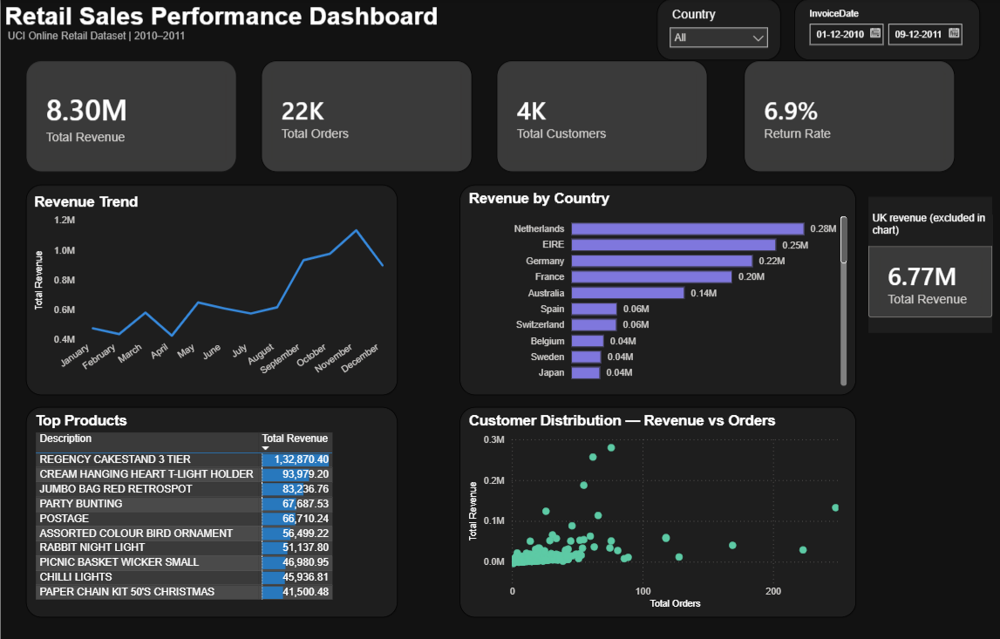

# Retail Sales Analytics — SQL & Power BI Project

An end-to-end data analytics project built on the UCI Online Retail dataset, covering database design, SQL analysis, and an interactive Power BI dashboard.



---
## Business Problem  

Retail businesses generate large volumes of transactional data, but raw transaction logs don't answer business questions on their own. This project simulates a scenario where a retail analytics team needs to understand: which markets and products drive revenue, how sales trend across the year, which customers represent the most value, and how returns are affecting net revenue — all from a single raw export of online transactions. 

---
## Project Overview

This project simulates a real-world retail analytics workflow: taking raw, messy transactional data and turning it into a normalized database, validated business insights, and a portfolio-quality interactive dashboard.

**Goal:** Analyze retail sales performance — revenue trends, customer behavior, product performance, and returns — to answer questions a retail business would realistically ask.

---

## Tools Used

- **MySQL** — data cleaning, database design, analysis
- **Power BI Desktop** — dashboard design, DAX measures, data visualization
- **Dataset:** [UCI Online Retail Dataset](https://archive.ics.uci.edu/dataset/352/online+retail)

---

## Database Design

The raw dataset was cleaned and normalized into four related tables:

- `customers`
- `products`
- `orders`
- `order_items`

A reporting view, `retail_sales_view`, joins all four tables into a single analysis-ready table at the transaction-line grain, with pre-calculated fields such as `net_line_revenue`, `gross_sales_revenue`, `return_value`, and time dimensions (`invoice_month_name`, `invoice_weekday`, `invoice_hour`).

**Data cleaning rules:**
- Removed rows with NULL or blank `CustomerID`
- Removed rows with NULL or blank `Description`
- Removed rows with `UnitPrice <= 0`
- Kept negative `Quantity` values (represent returns) — used to calculate return metrics separately

---

## SQL Skills Demonstrated

- Table joins across a normalized schema
- Views for reusable reporting logic
- `GROUP BY` aggregations
- `CASE` statements for conditional logic (sales vs. returns)
- CTEs (Common Table Expressions)
- Window functions: `DENSE_RANK()`, `LAG()`, `SUM() OVER()`
- Running totals
- Data validation queries (row count checks, uniqueness checks, date range checks)

### SQL Files

| File | Purpose |
|---|---|
| `00_data_cleaning.sql` | Clean and prepare raw data |
| `01_database_setup.sql` | Create normalized schema |
| `02_create_views.sql` | Build `retail_sales_view` |
| `03_data_validation.sql` | Validate row counts, dates, uniqueness |
| `04_business_analysis.sql` | Core business metrics |
| `05_customer_analysis.sql` | Customer-level analysis |
| `06_product_analysis.sql` | Product-level analysis |
| `07_time_analysis.sql` | Time-based trends |
| `08_advanced_analysis.sql` | Window functions, running totals, ranking |

---

## Power BI Dashboard

A single-page interactive dashboard built directly on top of `retail_sales_view`, designed to be read at a glance while still supporting deeper exploration through slicers.

### Key Metrics (KPI Cards)
- Total Revenue
- Total Orders
- Total Customers
- Return Rate

### Visuals

| Visual | Type | Insight |
|---|---|---|
| Revenue Trend | Line chart | Monthly revenue shows steady growth through the year, peaking in November ahead of the holiday season |
| Revenue by Country | Horizontal bar chart | International markets ranked by revenue (UK excluded — see note below — and shown separately as a reference card, since it represents the overwhelming majority of transactions as the retailer's home market) |
| Top Products | Table with data bars | Top 10 products by revenue |
| Customer Distribution | Scatter chart | Revenue vs. order count per customer, revealing a small group of high-frequency bulk buyers distinct from the majority of one-off/low-volume customers |

### Interactivity
- **Country slicer** — filter all visuals by country
- **Date range slicer** — filter by invoice date range

### DAX Measures

```dax
Total Revenue = SUM(retail_sales_view[net_line_revenue])
Gross Sales = SUM(retail_sales_view[gross_sales_revenue])
Total Returns = SUM(retail_sales_view[return_value])
Return Rate = DIVIDE([Total Returns], [Gross Sales], 0)
Total Orders = DISTINCTCOUNT(retail_sales_view[InvoiceNo])
Total Customers = DISTINCTCOUNT(retail_sales_view[CustomerID])
Units Sold = SUM(retail_sales_view[units_sold])
Units Returned = SUM(retail_sales_view[units_returned])
Avg Order Value = DIVIDE([Total Revenue], [Total Orders], 0)
```

---

## Key Insights

- Revenue grows steadily across the year and peaks in **November**, consistent with pre-holiday retail seasonality.
- The **UK is the dominant market** by a wide margin (as expected for a UK-based online retailer); the **Netherlands leads all other international markets**.
- Customer order behavior is highly skewed: most customers place a small number of orders, while a handful of high-frequency customers (250+ orders) contribute disproportionately to revenue — a pattern worth flagging for retention or wholesale-account strategy.
- Return rate sits at **6.9%** of gross sales, a useful baseline metric for tracking product quality or fulfillment issues over time.

---
## Limitations
* The dataset covers a single UK-based online retailer over roughly one year — findings reflect this specific business, not retail trends generally.
* Revenue is heavily skewed toward the UK market, which limits the depth of international comparison.
* No customer demographic data (age, gender, acquisition channel) was available, limiting segmentation beyond order behavior.
* Return reasons are not captured in the source data — the return rate is a volume metric, not a root-cause diagnosis.
--- 
## Future Improvements

## Project Structure

```
retail-sales-analytics/
│
├── sql/
│   ├── 00_data_cleaning.sql
│   ├── 01_database_setup.sql
│   ├── 02_create_views.sql
│   ├── 03_data_validation.sql
│   ├── 04_business_analysis.sql
│   ├── 05_customer_analysis.sql
│   ├── 06_product_analysis.sql
│   ├── 07_time_analysis.sql
│   └── 08_advanced_analysis.sql
│
├── powerbi/
│   └── retail_sales_dashboard.pbix
│
├── screenshots/
│   └── Dashboard.png
│
└── README.md
```

---

## How to Reproduce

1. Import the [UCI Online Retail Dataset](https://archive.ics.uci.edu/dataset/352/online+retail) into MySQL.
2. Run the SQL scripts in numerical order (`00` through `08`).
3. Open `retail_sales_dashboard.pbix` in Power BI Desktop.
4. Update the data source connection to point to your local MySQL instance.
5. Refresh the data.

---

## Author

**Shubham Salvi**
Data Analytics Portfolio Project
[LinkedIn](https://www.linkedin.com/in/shubham-salvi-6b9982286/) | [GitHub](https://github.com/ShubhamSalvi1/)
